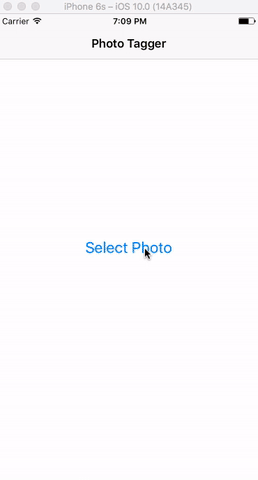

# alamofire-photo-tagger

The project is about to work with the [Imagga API](https://docs.imagga.com/#introduction) and give the users these opportunities.

The user can upload a photo via the simulator/camera to Imagga and as result gets specific Photo tags and colors which describe the photo.

**NOTE: Replace xxx in `ImaggaRouter.swift` with your auth token found at https://imagga.com/profile/dashboard**

## Result

## Installation

- Use [CocoaPods](https://cocoapods.org/) as dependency manager

To install, download it or clone and then start `pod install` in the project directory.

After that open the `.xcworkspace` file.

## Framework Reference

- Use [Alamofire](https://github.com/Alamofire/Alamofire) for simplifying common networking tasks.

## API Reference

- Use [Imagga API](https://docs.imagga.com/#introduction) to request movies
